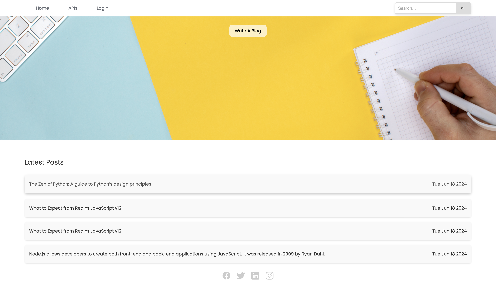

# WebDeveloping
Here I practice HTML5, CSS3, JavaScript, Node.js, Express.js, React.js, SQL, and PostgreSQL.
It also covers advanced topics like Web3, blockchain technology, and NFTs.

Web Blog Project

Welcome to my web blog project! This project is a personal blog where I practice my skills.

Features

Dynamic Content: Blog posts are rendered dynamically using EJS templating.
Responsive Design: Built with modern HTML, CSS, and JavaScript, the blog is fully responsive and works seamlessly across devices.
Interactive Elements: Includes interactive features such as a comment section, navigation, and social media sharing.
API Integration: Utilizes third-party APIs to fetch data and enhance the content.
Node.js and Express: The backend is powered by Node.js and Express, ensuring fast and scalable performance.

# WebBlog Project

This is a Node.js-based web application built using **Express.js** for the backend, **EJS** for rendering dynamic content, and **PostgreSQL** as the database. The project supports user authentication using **Passport.js** with local strategy for login, along with **bcrypt** for secure password hashing.

## Table of Contents
- [Features](#features)
- [Technologies Used](#technologies-used)
- [Installation](#installation)
- [Usage](#usage)
- [Project Structure](#project-structure)
- [Contributing](#contributing)
- [Photoes](#photoes)

## Features

- User registration and login with **bcrypt**-hashed passwords
- **Passport.js** for secure authentication
- Fetch and display content dynamically using **EJS**
- Responsive design using CSS
- API integration (if applicable)
- Flash messages for errors and notifications
- Secure user sessions

## Technologies Used

- **Node.js**: JavaScript runtime for the backend
- **Express.js**: Web framework for Node.js
- **PostgreSQL**: Relational database to store user data
- **EJS (Embedded JavaScript)**: Templating engine for rendering views
- **Passport.js**: Authentication middleware for Node.js
- **bcrypt**: Library for hashing and comparing passwords
- **connect-flash**: For displaying flash messages (e.g., login errors)
- **Joke API**: External API for fetching jokes
- **New York Times API**: External API for fetching news articles
- **LeetCode API**: External API for retrieving user stats from LeetCode
- **Weather API**: External API for fetching weather data

## Installation

1. Clone the repository:

   ```bash
   git clone https://github.com/Cherrymood/WebDeveloping.git
   cd WebDeveloping/backend/web-blog
2. Install the dependencies:
    ```bash
    npm install
4. Set up the PostgreSQL database:
    Create a PostgreSQL database and run the SQL scripts in the sql/ directory (if applicable) to set up your tables (e.g., registration).
    Update the database configuration in server.js or create a .env file with the necessary environment variables.
5. Run the application:
    ```bash
    node server.js

## Usage:

    Register a new user or log in using your credentials.
    View and interact with the blog content.
    Only logged-in users can access the editor to create or edit posts.

## Routes

/post: Create a new blog post (requires authentication)
/home: Home page
/joke: Fetch random jokes from the Joke API
/nytimes: Fetch news articles from the New York Times API
/stat: Fetch LeetCode stats for the logged-in user
/weather: Fetch current weather information from the Weather API
/login: User login page
/register: User registration page
/editor: Editor for creating or updating content (requires authentication)
/logout: Log out the current user

##Project Structure


## Photoes:




